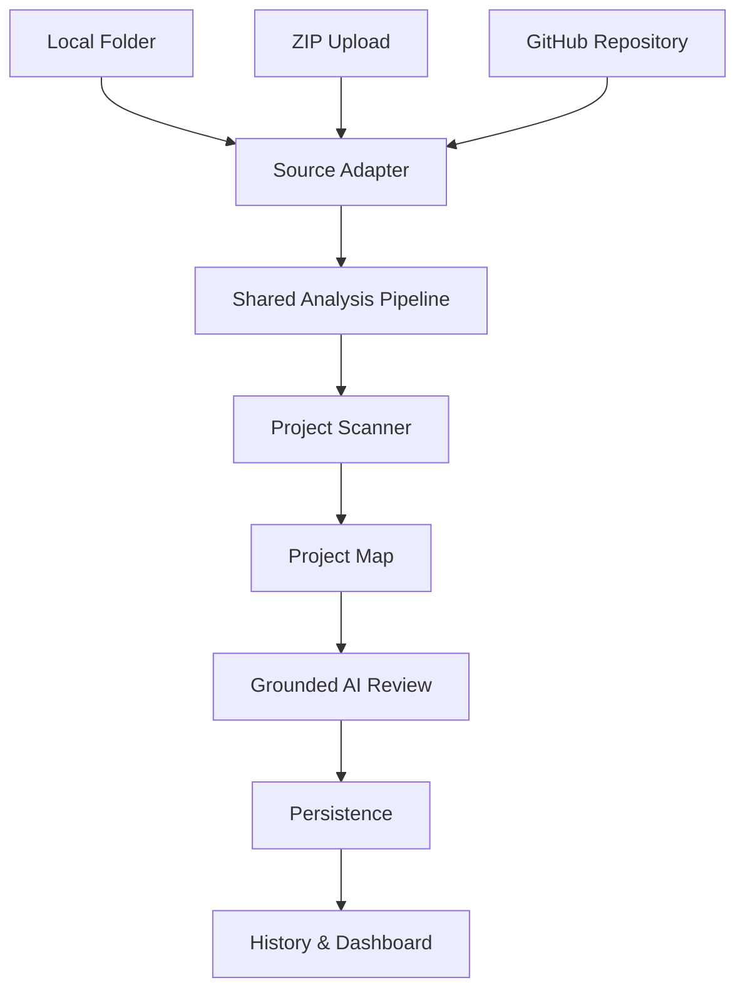

# CodeForge AI


CodeForge AI is an AI-powered software engineering assistant capable of analyzing projects from multiple sources. Evolving from a simple AI code reviewer, it now features a robust project scanning and shared analysis pipeline, delivering deep, evidence-grounded insights into codebases across local environments, ZIP archives, and public GitHub repositories.

## Project Highlights

- **AI-powered code review**: Get instant, actionable feedback on individual code snippets with syntax highlighting.
- **Local, ZIP, and GitHub project analysis**: Analyze projects regardless of where they are stored.
- **Shared Project Scanner architecture**: Source-agnostic project mapping decoupled from source ingestion.
- **Grounded AI project reviews**: Evidence-backed architectural reviews based on concrete codebase structure.
- **Modular FastAPI backend**: Clean, extensible services separated by responsibility.
- **Extensible source adapter architecture**: Pluggable ingestion for seamless expansion.

## Screenshots

* Dashboard
* Code Review
* Project Analysis
* GitHub Analysis

*(Images coming soon)*

## Key Features

- **AI Code Review**: Analyze code snippets instantly and get improvement suggestions.
- **Project Analysis**: Scan directories to extract frameworks, package managers, entry points, and database signatures.
- **GitHub Intelligence**: Seamlessly resolve branches, SHAs, and lightweight metadata (stars, forks, descriptions) from public repositories while preserving scanner independence.
- **Persistence & History**: Review past code and project analyses instantly, supported by a backwards-compatible SQLite persistence layer.
- **Architecture**: Employs a decoupled architecture separating source ingestion, scanning, review generation, and presentation.

## Architecture



## Architecture Principles

CodeForge AI is built around a few core design principles:

- The Project Scanner is source-agnostic.
- All project sources (Local, ZIP, GitHub) are normalized through Source Adapters.
- Every analysis follows the Shared Analysis Pipeline.
- AI reviews are grounded in the generated Project Map.
- New project sources should integrate through the adapter layer rather than modifying the scanner.

## Tech Stack

**Frontend:**
- React
- Vite
- Axios

**Backend:**
- FastAPI
- SQLAlchemy
- OpenRouter
- HTTPX
- Pydantic

**Database:**
- SQLite

## Project Structure

```text
codeforge-ai/
├── backend/
│   ├── main.py                     # FastAPI application entry point
│   ├── database.py                 # SQLite connection and migrations
│   ├── models/                     # Pydantic and SQLAlchemy models
│   ├── routes/                     # API endpoints (reviews, projects)
│   └── services/
│       ├── archive_service.py      # Secure zip extraction
│       ├── llm_service.py          # OpenRouter AI integration
│       ├── project_scan_service.py # Core project parsing logic
│       ├── source_adapter_service.py # Ingestion for Local, ZIP, GitHub
│       ├── project_pipeline_service.py # Orchestrates analysis flow
│       └── ...
└── frontend/
    ├── src/
    │   ├── components/
    │   │   └── CodeReviewer.jsx    # Main Dashboard and UI
    │   ├── styles/
    │   └── App.jsx
    └── package.json
```

## Implemented Workflow

1. **Source Ingestion:** A local folder, uploaded ZIP, or GitHub URL is processed by the `Source Adapter`, securely extracted if necessary, and mapped to a unified project root.
2. **Analysis Pipeline:** The `Shared Analysis Pipeline` orchestrates the complete flow from scanning to AI generation.
3. **Project Scanning:** The `Project Scanner` recursively maps the codebase to detect languages, frameworks, entry points, and important configuration files.
4. **Project Map Generation:** The scanner outputs a source-agnostic `Project Map`.
5. **Grounded Review:** The `Project Map` is fed to the LLM to generate an evidence-backed architectural review.
6. **Persistence:** The results and repository metadata are persisted to SQLite to populate the history dashboard.

## Installation & Running

### Backend Setup

1. Navigate to the `backend` directory:
   ```bash
   cd backend
   ```
2. Set up a virtual environment and activate it:
   ```bash
   python -m venv venv
   # On Windows:
   .\venv\Scripts\activate
   # On macOS/Linux:
   source venv/bin/activate
   ```
3. Install the required dependencies:
   ```bash
   pip install -r requirements.txt
   ```
4. Set your OpenRouter API key:
   ```bash
   # On Windows (PowerShell):
   $env:OPENROUTER_API_KEY="your_api_key_here"
   # On macOS/Linux:
   export OPENROUTER_API_KEY="your_api_key_here"
   ```
5. Start the FastAPI server:
   ```bash
   uvicorn main:app --reload --port 8000
   ```

### Frontend Setup

1. Navigate to the `frontend` directory:
   ```bash
   cd frontend
   ```
2. Install dependencies:
   ```bash
   npm install
   ```
3. Start the Vite development server:
   ```bash
   npm run dev
   ```

## API Overview

The backend provides several core endpoints to drive the intelligence pipeline:

- `POST /api/review` - Accepts code snippets and returns a generated AI code review.
- `GET /api/reviews` - Retrieves the history of generated reviews and project analyses.
- `POST /api/projects/scan` - Analyzes a local project directory.
- `POST /api/projects/upload` - Securely uploads, extracts, and analyzes a ZIP archive.
- `POST /api/projects/github` - Clones, extracts, and analyzes a public GitHub repository.

## Current Capabilities

CodeForge AI currently supports:
- **Local folder analysis**: Direct traversal of local directories.
- **ZIP upload**: Secure extraction with file size and file count protections.
- **GitHub Repository Analysis**:
  - Accepts full repository URLs.
  - Supports optional branch or tag references (e.g., `main`, `v2.31.0`).
  - Resolves specific commit SHAs.
  - Fetches repository metadata (stars, forks, descriptions).
  - Handles 301 redirects and precise GitHub API error mapping (404, 403).
- **Instant AI code review**: Contextual snippet evaluation.
- **Project history**: Reload past analyses instantly using SQLite persistence.
- **Grounded project reviews**: AI insights strictly tied to concrete file evidence.

## Roadmap

**Phase 3**
- Repository-Aware RAG (Intelligent retrieval for large codebases)

**Phase 4**
- Pull Request Review (Automated review for PR diffs)

**Phase 5**
- Authentication & Deployment (User accounts, RBAC, and Production deployment)

**Phase 6**
- Team Collaboration (Multi-user workspaces and sharing)

## Project Evolution

The evolution of CodeForge AI follows a strict milestone-driven approach:
- [x] AI Code Review
- [x] Review History
- [x] Project Scanner
- [x] Grounded Reviews
- [x] Project Dashboard
- [x] ZIP Upload
- [x] GitHub Repository Analysis
- [x] GitHub Intelligence
- [ ] **Repository-Aware RAG (Next)**

## Future Vision

The long-term goal for CodeForge AI is to transform from an AI code reviewer into a fully **repository-aware AI software engineering assistant**. By implementing advanced RAG (Retrieval-Augmented Generation) and semantic understanding, CodeForge will enable developers to converse intelligently with massive codebases, review complex PRs autonomously, and integrate seamlessly into professional team workflows.

## Contributing

Contributions are welcome. Please ensure that all new features adhere strictly to our architectural principles:
- **Preserve Source Adapter Architecture**: Keep ingestion modules completely separated from the scanner logic.
- **Preserve Shared Analysis Pipeline**: All ingestion mechanisms must feed into the same standard pipeline.
- **Maintain Scanner Independence**: The Project Scanner must remain entirely agnostic of where the project originated (e.g., local vs. GitHub).

## License

MIT License
